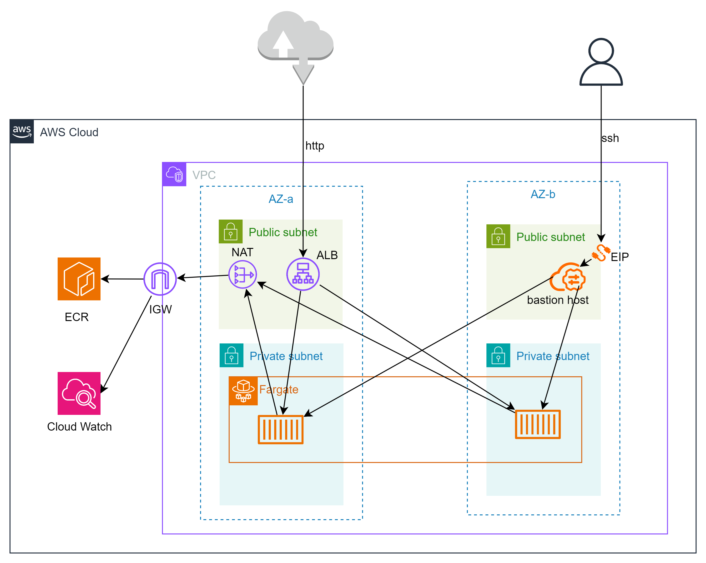
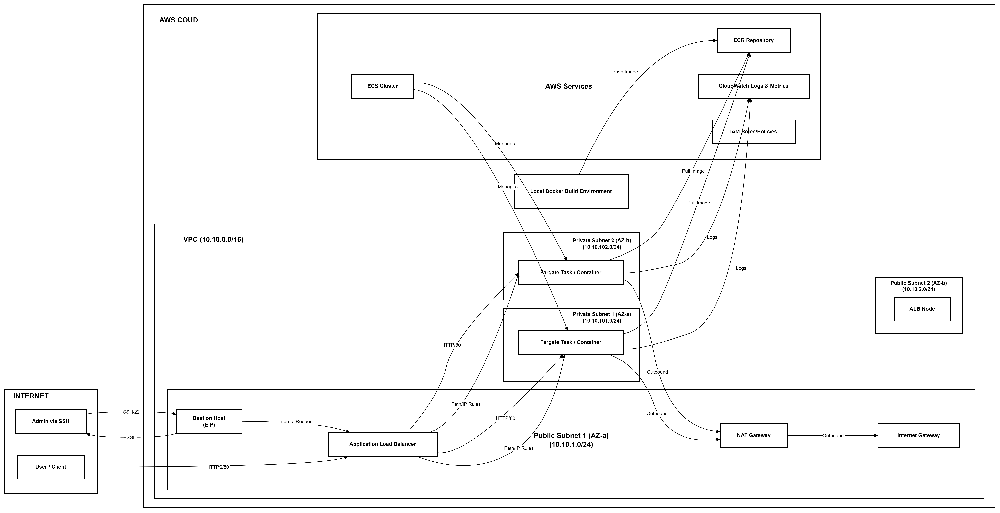

# Vending Machine Microservice - AWS Fargate Deployment

## Overview

This repository contains the infrastructure code (Terraform) and deployment instructions for the Vending Machine microservice. The goal is to deploy the microservice onto AWS Fargate, exposing specific endpoints publicly while keeping others private, accessible only from within a designated network or via a secure bastion host.

**Deployment Requirements:**

*   **Public Endpoints:** `GET /beverages`, `POST /beverages` - Accessible over the public internet.
*   **Private Endpoint:** `GET /ingredients` - Accessible only from within the private network (specifically, from allowed CIDR ranges or the Bastion host).
*   **Infrastructure as Code:** All AWS infrastructure is provisioned using Terraform.
*   **Containerization:** The microservice is expected to be containerized using Docker.

## Architecture Diagram







## Architecture Description

1. **VPC & Networking:** A custom Virtual Private Cloud (VPC) provides network isolation.
    - **Public Subnets:** Span across two Availability Zones (AZs) for high availability. Resources needing direct internet access (ALB, Bastion Host, NAT Gateway) reside here. An Internet Gateway allows communication with the internet.
    - **Private Subnets:** Span across two AZs. The Fargate tasks run here, preventing direct public exposure.
    - **NAT Gateway:** Placed in a public subnet, it allows instances in private subnets (like the Fargate tasks) to initiate outbound connections (e.g., to pull images from ECR or access other AWS services) while blocking inbound connections from the internet.
2. **Containerization & Orchestration (ECS Fargate):**
    - **ECR (Elastic Container Registry):** A private Docker image registry stores the Vending Machine microservice container image.
    - **ECS Cluster:** A logical grouping of services and tasks.
    - **Fargate Launch Type:** AWS manages the underlying infrastructure, allowing us to run containers without managing EC2 instances directly (serverless compute for containers).
    - **Task Definition:** A blueprint describing the container(s) to run: image location (ECR), CPU/memory allocation, port mappings, and logging configuration.
    - **ECS Service:** Maintains the desired number of Fargate tasks (instances of the Task Definition), handles registration with the ALB, and manages deployments across private subnets in multiple AZs.
3. **Load Balancing (ALB):**
    - **Application Load Balancer (ALB):** A public-facing ALB receives incoming HTTP requests on port 80. It distributes traffic across the healthy Fargate tasks running in the private subnets.
    - **Target Group:** Groups the Fargate tasks. The ALB checks the health of tasks using the `/beverages` endpoint.
    - **Listener Rules:**
        - **Public Rule (`/beverages*`):** Allows requests to paths starting with `/beverages` from _any_ source IP address (0.0.0.0/0) and forwards them to the Target Group.
        - **Private Rule (`/ingredients*`):** Allows requests to paths starting with `/ingredients` _only_ if the source IP address matches the `private_api_allowed_cidr` variable _or_ the specific public IP address of the Bastion Host. Other requests to this path are implicitly denied (or get the default 404).
        - **Default Action:** If no rule matches, the ALB returns a 404 "Not Found".
4. **Security:**
    - **Security Groups:** Act as virtual firewalls:
        - `alb_sg`: Allows inbound HTTP (port 80) from anywhere. Allows all outbound.
        - `fargate_sg`: Allows inbound traffic _only_ from the ALB (`alb_sg`) and the Bastion Host (`bastion_sg`) on the container port (`var.container_port`). Allows all outbound (needed for ECR pulls, CloudWatch logs, etc. via NAT).
        - `bastion_sg`: Allows inbound SSH (port 22) _only_ from the IPs specified in `bastion_allowed_cidr`. Allows all outbound.
    - **IAM Roles:** The `ecs_task_execution_role` grants the ECS agent permissions to pull images from ECR and send logs to CloudWatch.
5. **Bastion Host:** An EC2 instance in a public subnet with an Elastic IP address. It serves as a secure jump point to access resources within the private network (like testing the private `/ingredients` endpoint via the ALB). Access is restricted by the `bastion_sg`.
6. **Logging & Monitoring:**
    - **CloudWatch Logs:** Container logs are streamed to a dedicated CloudWatch Log Group (`/ecs/vm-app`).
    - **CloudWatch Metrics:** ALB metrics (request counts, latency, errors) and ECS metrics (CPU/Memory utilization via Container Insights) are available.
7. **Infrastructure as Code (Terraform):** Terraform manages the lifecycle of all the AWS resources described above, ensuring repeatable and version-controlled infrastructure deployments.


## Technology Choices & Rationale

- **Cloud Provider: AWS:** A leading cloud provider with a mature ecosystem, comprehensive services (VPC, ECS, ECR, ALB, IAM), and robust infrastructure.
- **Container Orchestration: AWS ECS Fargate:** Chosen for its serverless nature. It eliminates the need to manage underlying EC2 instances, simplifying operations and scaling based on load. It integrates seamlessly with other AWS services like ALB, ECR, and CloudWatch.
- **Load Balancer: Application Load Balancer (ALB):** Selected for its Layer 7 capabilities, specifically path-based and source-IP-based routing, which are essential for meeting the public/private endpoint requirements. It also provides health checks and integrates directly with ECS.
- **Container Registry: AWS ECR:** A fully managed Docker registry tightly integrated with AWS IAM and ECS, simplifying image management and security. Scan-on-push provides vulnerability scanning.
- **Infrastructure as Code: Terraform:** An industry-standard tool for IaC. Its declarative approach, state management, and wide provider support allow for reliable and automated provisioning of cloud resources across potentially multiple environments.
- **Networking: AWS VPC:** Provides fundamental network isolation and control required for secure application deployment. The public/private subnet structure is a standard best practice.
- **Secure Access: Bastion Host:** A standard security pattern for accessing private resources without exposing management ports or internal endpoints directly to the internet. Using an EC2 instance provides a familiar Linux environment for testing tools like `curl`.
- **Logging: AWS CloudWatch Logs:** The native logging solution for AWS services, including ECS Fargate. It provides centralized log aggregation and basic analysis capabilities.

## Prerequisites

1. **AWS Account:** An active AWS account with sufficient permissions to create the resources defined in the Terraform code (VPC, EC2, ECS, ECR, ALB, IAM roles, etc.).
2. **AWS CLI:** Installed and configured with credentials (`aws configure`).
3. **Terraform:** Installed (version compatible with the `required_version` constraint if specified, otherwise latest stable recommended).
4. **Docker:** Installed and running locally (required for building and pushing the microservice image).
5. **Git:** Installed for cloning this repository.
6. **EC2 Key Pair:** An existing EC2 Key Pair in the target AWS region. The private key (`.pem` or `.ppk` file) to SSH into the Bastion host. The _name_ of the key pair will be a Terraform variable.
7. **Vending Machine Microservice Code & Dockerfile:** The source code for the microservice and a valid `Dockerfile` must be present in the root directory of this repository. The `Dockerfile` should expose the port defined by `var.container_port` (default: 3000).


## Setup & Deployment

1. **Clone the Repository:**
```
git clone <repository-url>
cd <repository-directory>
```
2. **Configure Terraform Variables:**

- Create a file named `terraform.tfvars` in the root directory.
- Add the following required variables, replacing the example values:
```hcl
aws_region = "us-central-1" # Or your desired AWS region
bastion_ssh_key_name = "your-ec2-key-pair-name" # Name of your existing EC2 Key Pair

# IMPORTANT: Configure allowed IPs for private API and Bastion
# Replace with CIDR blocks of networks allowed to access GET /ingredients
# e.g., ["10.10.0.0/16", "203.0.113.10/32"]
private_api_allowed_cidr = ["YOUR_PRIVATE_NETWORK_CIDR"]

# IMPORTANT: Restrict SSH access to the Bastion Host!
# Replace 0.0.0.0/0 with your specific public IP address /32
# Find your IP: curl ifconfig.me
# e.g., ["10.10.0.0/16","1.2.3.4/32"]
bastion_allowed_cidr = ["VPC_CIDR","YOUR_PUBLIC_IP/32"]

# Optional: Override defaults if needed
# vpc_cidr             = "10.10.0.0/16"
# container_port       = 3000
# container_cpu        = 256
# container_memory     = 512
# bastion_instance_type = "t3.micro"
```

- **Security Warning:** Do _not_ leave `bastion_allowed_cidr` as `["0.0.0.0/0"]` in a production or sensitive environment. It is adviced to restrict it to your IP address.

3. **Initialize Terraform:**
```bash
terraform init
```


4. **Plan the Deployment:** Review the resources Terraform will create.
```bash
terraform plan -out=tfplan
```


5. **Apply the Deployment:** This command provisions the AWS resources. It will also trigger the `local-exec` provisioner to:

- Log in to AWS ECR using the AWS CLI.
- Build the Docker image using the `Dockerfile` in the current directory.
- Tag the image.
- Push the image to the created ECR repository.
- Finally, create the ECS service using the pushed image.

**IMPORTANT**: interpreter is by default set to powershell, on a Windows environment. It can be changed to bash commenting out the default interpreter and selecting the bash one for Linux environment in `main.tf`

```bash
terraform apply tfplan
```

- Type `yes` when prompted.
- Note the output values, especially `alb_dns_name` and `bastion_public_ip`.

## Testing the Deployment

You will need the `alb_dns_name` and `bastion_public_ip` from the `terraform apply` output.

1. **Test Public Endpoints (`/beverages`)** :

    - Open your web browser or use `curl` from your local machine. Replace `<alb_dns_name>` with the actual output value.
	- **GET Request:**
	```bash
	curl http://<alb_dns_name>/beverages
	```
	- **POST Request:**
	```bash
	curl -X POST http://<alb_dns_name>/beverages \
	-H "Content-Type: application/json" \
	-d '{"beverageName": "coffee","sugarLevel": 3,"coins": [2, 0.2, 0.2, 0.2 ]}'
	```

 - Verify you receive successful responses (e.g., HTTP 200 OK, 201 Created).

2. **Test Private Endpoint (`/ingredients`)** :

- **Attempt Direct Access (Should Fail):** Try accessing the `/ingredients` endpoint directly from your local machine. This should be blocked by the ALB rule's source IP condition.

```bash
curl -v http://<alb_dns_name>/ingredients
# should be not found
```


**Access via Bastion Host (Should Succeed):**

1. SSH into the Bastion host using its public IP and your private key:

```bash
ssh -i /path/to/your/private-key.pem ec2-user@<bastion_public_ip>
```

2. From _within the Bastion host's shell_ , use `curl` to access the `/ingredients` endpoint via the ALB's DNS name. This works because the Bastion's EIP is explicitly allowed in the ALB Listener Rule (`ingredients_rule`).

```bash
curl http://<alb_dns_name>/ingredients
```

3. Verify you receive a successful response (e.g., HTTP 200 OK).

## Configuration

Key configurable parameters are defined in `variables.tf` and should be set in `terraform.tfvars`:

- `aws_region`: The target AWS region for deployment.
- `vpc_cidr`: CIDR block for the VPC. Default: `10.10.0.0/16`.
- `public_subnet_cidrs`: CIDR blocks for public subnets. Default: `["10.10.1.0/24", "10.10.2.0/24"]`.
- `private_subnet_cidrs`: CIDR blocks for private subnets. Default: `["10.10.101.0/24", "10.10.102.0/24"]`.
- `private_api_allowed_cidr`: **Required.** List of CIDR blocks allowed to access the private `/ingredients` endpoint via the ALB.
- `bastion_allowed_cidr`: **Required.** CIDR block allowed SSH access to the Bastion host. **Crucial for security - restrict this!**
- `bastion_instance_type`: EC2 instance type for the Bastion host. Default: `t3.micro`.
- `bastion_ssh_key_name`: **Required.** The name of your existing EC2 Key Pair for Bastion access.
- `container_port`: Port the application container listens on. Default: `3000`.
- `container_cpu`: CPU units for the Fargate task. Default: `256` (0.25 vCPU).
- `container_memory`: Memory (in MiB) for the Fargate task. Default: `512` (0.5 GB).

## Monitoring & Logging

- **Container Logs:** Navigate to the AWS CloudWatch console -> Log Groups. Find the log group named `/ecs/vm-app`. You will see log streams for each running container instance.
- **ALB Metrics:** In CloudWatch -> Metrics, look under the "ApplicationELB" namespace for metrics like `RequestCount`, `HTTPCode_Target_2XX_Count`, `TargetResponseTime`, etc., filtered by your Load Balancer name (`vm-alb`).
- **ECS Fargate Metrics:** In CloudWatch -> Metrics, look under the "ECS/ContainerInsights" namespace (if Container Insights is enabled, which it is by default in this config) for CPU and Memory utilization for your service (`vm-service`) and cluster (`vm-cluster`).


## Cleanup

To remove all resources created by this Terraform configuration and avoid ongoing charges:

1. **Destroy Resources:** Run the following command from the directory containing your Terraform files:
```bash
terraform destroy
```

2. **Confirm:** Type `yes` when prompted.
3.
**Warning:** This command will permanently delete all the AWS resources managed by this Terraform state (VPC, Subnets, ALB, ECS Service, Tasks, ECR Repository, Bastion Host, etc.).

**Note on ECR:** The `aws_ecr_repository` resource has `force_delete = true`. This means Terraform will attempt to delete the repository even if it contains images. If you prefer to keep the images or manually manage deletion, remove the `force_delete = true` argument before running `destroy`.
